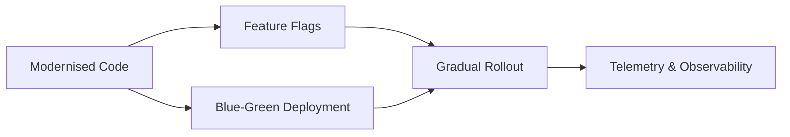

# Chapter 6 – Verification and Rollout

## 6.1 Testing Layers

| Layer | Purpose | Copilot Contribution | Human Oversight |
|------|---------|----------------------|-----------------|
| Unit | Verify logic correctness | Generate JUnit5 tests | Design edge cases |
| Integration | Validate module interactions | Scaffold tests | Configure environments |
| Contract | Preserve interface parity | Create mock tests | Compare responses |
| Performance | Validate NFRs | Suggest load tests | Interpret results |

## 6.2 Rollout Strategies



**Prompts:**
```text
Add simple health endpoints and logging for critical paths.
Draft a GitHub Actions YAML for CI build and test.
```

## 6.3 Copilot in Reviews

Use Copilot to propose diffs explanations and summarise PR changes, but retain human approval gates.
