# **Modernising Java Applications with GitHub Copilot**

### *An AI-Enabled Approach to Accelerating Application Renewal*

---

## **Table of Contents**
1. [Foreword](#foreword)
2. [Executive Summary – The Imperative for AI-Enabled Modernisation](#executive-summary--the-imperative-for-ai-enabled-modernisation)
3. [The Modernisation Spectrum](#1--the-modernisation-spectrum)
4. [Factors that Influence GitHub Copilot for Java App Modernisation](#2--factors-that-influence-github-copilot-for-java-app-modernisation)
5. [The Analysis-First Playbook – Laying the Foundations](#3--the-analysis-first-playbook--laying-the-foundations)
6. [The Reverse-then-Forward Pattern](#4--the-reverse-then-forward-pattern)
7. [Execution Playbooks and Copilot’s Role](#5--execution-playbooks-and-copilots-role)
8. [Testing, Rollout, and Governance](#6--testing-rollout-and-governance)
9. [Scaling Impact Across the Enterprise](#7--scaling-impact-across-the-enterprise)
10. [Prompt Library and Practical Tools](#8--prompt-library-and-practical-tools)
11. [Governance and Responsible AI](#9--governance-and-responsible-ai)
12. [Appendix – Visuals and References](#10--appendix--visuals-and-references)

---

## **Foreword**

Modernising Java applications is no longer a maintenance exercise — it is a strategic lever for innovation. Across industries, organisations are finding that decades of Java investments now sit at a crossroads: the code still runs critical business logic, yet it limits speed, resilience, and the ability to adopt cloud-native architectures.

> **Insight**: Generative AI tools such as **GitHub Copilot** have introduced a new paradigm for software renewal. Copilot is not a “code generator” but a *cognitive amplifier* that helps developers and architects understand, refactor, and safely transform legacy systems at scale.

This guide unites strategic insight and practical application. It is written for architects, engineers, and technical leaders tasked with translating complex legacy systems into modern, agile platforms — using Copilot as an enabler, not a replacement for human expertise.

---

## **Executive Summary – The Imperative for AI-Enabled Modernisation**

> **Modernisation is now a business necessity, not an optional upgrade.**

Organisations built on Java must innovate faster than ever. Yet legacy code, aging frameworks, and scarce expertise make change risky. Traditional automation accelerates change but often ignores context, leading to costly regressions.

### **Key Insights**:
1. **Understand before refactor** – Knowledge precedes change.
2. **Reverse before forward** – Derive the system’s logic before rewriting it.
3. **AI-augmented development** – When guided by disciplined engineering practice, **GitHub Copilot accelerates comprehension, automates refactoring, and maintains behavioural integrity**.

---

## **1  |  The Modernisation Spectrum**

Every legacy Java application falls somewhere on a continuum from small updates to fundamental rewrites. Understanding the spectrum helps determine effort, risk, and where Copilot adds value.

| **Tier**                              | **Scenario**                                            | **Typical Challenges**                               | **AI Assist Coverage**                                                      |
| ------------------------------------- | ------------------------------------------------------- | ---------------------------------------------------- | --------------------------------------------------------------------------- |
| **S0 – Minor Upgrade**                | Incremental version bump (e.g., Spring Boot 3.2 → 3.3)  | Minimal API drift                                    | **High** – Copilot automates repetitive refactors and dependency updates.   |
| **S1 – Major Upgrade**                | Migration across major versions (Spring Boot 2.x → 3.x) | `javax → jakarta`, JDK 17+ requirements              | **Medium–High** – Copilot handles namespace migration and syntax updates.   |
| **S2 – Framework Jump**               | Spring Framework → Spring Boot                          | Configuration and dependency re-architecture         | **Medium** – Copilot assists config rewrites and pattern detection.         |
| **S3 – Replatforming**                | Java EE on app servers → Cloud runtime                  | Repackaging EAR/WAR, removing container dependencies | **Low–Medium** – Automates code conversion; architecture remains human-led. |
| **S4 – UI Migration**                 | JSF/Struts → MVC/WebFlux                                | Paradigm shift in navigation and state               | **Low** – Syntax aid only; UX design manual.                                |
| **S5 – Architectural Transformation** | Monolith → Microservices                                | Domain decomposition, distributed transactions       | **Low** – Copilot supports extraction but not business boundary definition. |

> **Tip**: The farther the effort moves from simple upgrades toward fundamental rewrites, the more human insight and planning matter. GitHub Copilot’s assistance diminishes for higher tiers because those involve design changes, not just code changes.

---

## **2  |  Factors that Influence GitHub Copilot for Java App Modernisation**

Pure automation treats code as text to transform; modernisation requires understanding behaviour and intent. Blind refactoring introduces subtle regressions — especially when tests are incomplete or absent.

### **Common Challenges and Mitigations**

| **Problem**           | **Example**                             | **Root Cause**             | **Mitigation with Copilot**                                             |
| --------------------- | --------------------------------------- | -------------------------- | ----------------------------------------------------------------------- |
| **Logic loss**        | Tax calculation removed during refactor | Code changed without tests | Use Copilot to *generate explanations and unit tests* before rewriting. |
| **Config drift**      | Properties mis-mapped to YAML           | Semantic mismatch          | Ask Copilot to *explain each property’s purpose* before conversion.     |
| **API regression**    | Changed REST signatures                 | Lack of contract testing   | Use Copilot to *generate and compare API contract tests*.               |
| **Security exposure** | Sensitive logs introduced               | Over-automation            | Retain manual review and secret scanning.                               |

Before diving into modernisation, it is important to understand that each upgrade scenario may require a different approach. Legacy systems vary widely; assuming a single solution pattern that covers all cases is risky. 
Some factors that make each modernisation effort unique:

| **Factor**                     | **Description**                                                                                                                                                                                                                     | **Copilot’s Role**                                                                                     |
|-------------------------------|-------------------------------------------------------------------------------------------------------------------------------------------------------------------------------------|-------------------------------------------------------------------------------------------------------|
| **Framework & Runtime Gaps**  | Upgrading Java frameworks can introduce major shifts (e.g., Java EE → Jakarta EE, JDK 8 → 17/21). These changes ripple through the codebase and must be addressed everywhere.                                           | Mechanises tasks like renaming packages but requires developers to assess subtle API behavior changes. |
| **Packaging & Infrastructure**| Legacy apps packaged as EAR/WAR files may need re-architecting for modern deployments (e.g., JARs, containers). Cloud targets (VMs, Azure App Service, Kubernetes) require tailored adjustments.                          | Provides suggestions but needs guidance based on the chosen architecture.                              |
| **UI Paradigm Changes**       | Replacing frameworks like JSF/Struts with modern ones (e.g., Angular, React, Spring MVC) involves a paradigm shift in navigation and state management. Automation is limited to small code fragments.                        | Assists with code rewrites (e.g., converting Struts Actions to Spring MVC controllers).               |
| **Environmental Differences** | Modernisation often involves moving to cloud services or new infrastructure (e.g., cloud storage, messaging systems). Aligning the app with new APIs and best practices is critical.                                           | Requires clear instructions to use the right cloud SDKs and build resilient configurations.            |
| **Testing Gaps**              | Older applications often lack automated tests, increasing the risk of regressions during modernisation. Creating new unit/integration tests is essential to ensure behavioral parity.                                         | Helps generate tests once areas needing coverage are identified.                                      |

In summary, **each legacy app has unique quirks** – from outdated libraries to implicit business rules. Copilot accelerates repetitive changes (e.g. renaming APIs, updating dependencies) and helps surface hidden complexities, but it cannot fully grasp the intent and context of a specific application. **That’s why analysis and a tailored plan are essential**. The next section outlines how to perform that analysis.

---

## **3  |  The Analysis-First Playbook – Laying the Foundations**

Thorough analysis and preparation are the foundation of a successful modernisation effort. Before writing or generating any new code, teams must comprehensively understand the existing system. GitHub Copilot is extremely useful in this phase as an “AI research assistant” – it can summarise code, generate documentation, and identify potential problems – but it needs to be directed. 

### **Inventory and Discovery**

Use Copilot as an AI research assistant to build a factual baseline:
| **Aspect**                | **Details**                                                                                                                                            | **Copilot’s Role**                                                                                     |
|--------------------------|----------------------------------------------------------------------------------------------------------------------------------------------------|-------------------------------------------------------------------------------------------------------|
| **Modules & Build System** | Identify how the app is structured (e.g., Maven multi-module, Gradle, Ant). Influences how upgrades are applied (e.g., parent POM version bumps). | Assists in summarising build files and identifying dependencies.                                      |
| **Frameworks & App Servers** | Document versions of frameworks (e.g., Spring, Java EE) and app servers (e.g., Tomcat, JBOSS). Indicates migration needs.                          | Provides migration prompts and highlights specific framework changes.                                 |
| **Runtime & Environment** | Note Java SE version (e.g., 8, 11) and container/OS dependencies. Define the target environment (e.g., Azure App Service, AWS EKS).                 | Suggests adjustments based on runtime and environment context.                                        |
| **Testing & CI/CD**       | Check test coverage and CI pipeline health. Plan to create tests if lacking.                                                                      | Generates unit/integration tests and validates CI configurations.                                     |
| **Third-Party Dependencies** | Gather external libraries and versions. Identify vulnerabilities or incompatibilities with newer Java versions.                                   | Lists dependencies and flags outdated or vulnerable libraries.                                        |

> **Pro Tip**: Feed Copilot the `pom.xml` or `build.gradle` in sections and ask for a summary of dependencies and plugins. Questions like "identify which Java EE technologies this app uses" after providing a code snippet might reveal usage of servlets, EJBs, JMS, etc.
Example prompt
Analyse this repository and list frameworks, versions, and Java compatibility issues.
Copilot might respond:
Spring 4.3, Hibernate 4.2, JSF 2.0, Java 8. Risks: javax imports, limited test coverage.

### **3.2  Risk and Compatibility Analysis**

Copilot can scan for deprecated APIs, unsafe patterns, and untested modules.

* Identify `javax.*` usage and flag files for `jakarta.*` migration.
* Detect unsupported reflection APIs for JDK 17+.
* Summarise large classes: *“Explain this method line by line.”*
* Generate dependency graphs to reveal hidden coupling.


---

### **3.3  Decision Artifacts**

Create lightweight yet formal documentation to maintain clarity:

* **Architecture Decision Records (ADRs)** – key choices and rationale.
* **Migration Storyboard** – phased sequence of modernisation steps.
* **Risk Log** – anticipated issues and mitigation actions.

> *Copilot can draft ADRs and plans, but validation remains human-owned.*

---

## **4  |  The Reverse-then-Forward Pattern**

The Reverse-then-Forward strategy is a recommended method for system modernisation. It begins with a thorough reverse engineering of the existing system to gain a complete understanding of its behaviour and functionality. Using these insights, the next step is forward engineering to design and implement the new or updated system.

This approach ensures that all requirements are captured and subtle behaviours are preserved before changes are introduced. By prioritising investigation (with Copilot assistance) before innovation, the method maintains behavioural equivalence while applying modern design principles.


### ⚙️ Principle

Instead of rushing to refactor, start by **teaching Copilot about your code**. Reverse-engineer what exists first; then use that knowledge to rebuild confidently.

### 🧩 Example 1: Copilot Without and With Reverse-Then-Forward Technique

**Without applying the technique**

```text
Prompt: "Modernize this legacy service to Spring Boot 3 and Java 21."
```

Copilot output:

```java
@Service
public class InvoiceService {
    public void processInvoice(Invoice inv) {
        // migrated method
        inv.calculateTotal();
    }
}
```

✅ Compiles
⚠️ Business logic lost
⚠️ No tests or documentation
⚠️ No assurance of behavioral parity

---

**After applying reverse-then-forward technique**

Step 1 – Prompt Copilot:

```text
Explain what this class does, method by method.
```

Output:

```java
// Handles invoice validation, tax calculation, and persistence.
// Depends on TaxService and InvoiceRepository.
```

Step 2 – Extract specifications:

```text
Generate user stories and acceptance criteria from this class.
```

Output:

```
- The system must validate invoice items.
- The system must apply tax rules per region.
- The system must persist invoices in a relational store.
```

Step 3 – Generate tests:

```text
Create JUnit5 tests to verify this behavior.
```

Output:

```java
@Test
void shouldApplyRegionalTaxRate() {
    Invoice inv = new Invoice(...);
    assertEquals(110, service.calculate(inv));
}
```

Step 4 – Now modernize:

```text
Modernize this class to Spring Boot 3 ensuring tests still pass.
```

✅ Tests pass
✅ Logic preserved
✅ Documentation improved
✅ Developer confidence high

---

### 🧭 Example 2: Configuration Migration

**Without analysis:**

```text
Prompt: "Convert all .properties to YAML."
```

Copilot output:

```yaml
server: port: 8080
```

⚠️ Formatting errors, lost nested keys.

**After structured prompting:**

```text
Explain what each property controls, then safely migrate to Spring Boot 3 YAML.
```

Copilot output:

```yaml
server:
  port: 8080
spring:
  datasource:
    url: jdbc:h2:mem:testdb
    username: sa
```

✅ Semantic accuracy retained.

---

### 🔁 Example 3: Integration Refactor

**Before:** Copilot asked to “convert EJB to Spring service” directly → removed transaction boundary.

**After:** Developer first prompts for:

```text
Explain how transactions are managed in this class.
```

Then:

```text
Generate equivalent @Transactional Spring implementation maintaining isolation level.
```

✅ Transaction integrity preserved.

> 🚀 *Result:* Copilot transitions from code generator → reliable modernization assistant when guided by analysis-first tactics.

---


### **Steps in the Reverse-then-Forward Approach**

1. **Reverse Engineer Specifications**
   - **Objective**: Understand the current codebase and derive its functionality.
   - **Action**: Use tools like Copilot to create diagrams (e.g., Mermaid UML) and document hidden business rules.
   - **Outcome**: Build a mental and written model of the legacy system.

2. **Extract Requirements**
   - **Objective**: Identify what the system must continue to do post-modernisation.
   - **Action**: Outline user stories, mark unused features for deprecation, and create a backlog of features to re-implement or verify.
   - **Outcome**: Ensure no critical functionality is dropped during modernisation.

3. **Generate Tests**
   - **Objective**: Treat the legacy system as a black box and preserve its behavior.
   - **Action**: Write tests for critical paths, leveraging Copilot to generate unit tests, contract tests, and characterisation tests.
   - **Outcome**: Establish a safety net to catch unintended changes during refactoring.

4. **Modernise Safely**
   - **Objective**: Incrementally design and implement the modernised solution.
   - **Action**: Replace legacy modules while ensuring functionality remains intact. Use Copilot to stub out components and expedite boilerplate writing.
   - **Outcome**: Achieve a modernised system with minimal risk.

5. **Validate Outcomes**
   - **Objective**: Ensure the modernised system meets the same contract as the legacy system.
   - **Action**: Compare outputs of old and new versions using contract tests or integration tests. Use Copilot to assist in writing validation scripts.
   - **Outcome**: Confidently decommission the legacy system after validation.

```mermaid
sequenceDiagram
    participant Dev as Developer
    participant Copilot
    participant Legacy
    participant Tests
    participant Modern

    Dev->>Copilot: Explain legacy code
    Copilot->>Legacy: Analyse structure
    Copilot-->>Dev: Summaries & diagrams
    Dev->>Copilot: Generate tests
    Copilot->>Tests: JUnit5 coverage
    Dev->>Copilot: Suggest refactor
    Copilot->>Modern: Generate updated code
    Tests-->>Dev: All green ✅
```



---
✅ Logic preserved  |  ✅ Documentation produced  |  ✅ Behaviour verified

## **5  |  Execution Playbooks and Copilot’s Role**
Copilot’s contribution varies by task type. Use it where it amplifies productivity and accuracy — not where it replaces judgement.

| **Task Type**      | **Description**                        | **Copilot’s Role**                 | **Developer’s Role**          |
| ------------------ | -------------------------------------- | ---------------------------------- | ----------------------------- |
| **Automatable**    | Bulk renames, dependency updates       | Generate refactors and patches     | Review and merge              |
| **Semi-Automated** | Config rewrites, modular restructuring | Suggest scaffolds and patterns     | Curate, test, and refine      |
| **Manual**         | UI redesign, domain decomposition      | Draft boilerplate or documentation | Architect and validate design |

### ** Effectiveness Curve**


---

## **6  |  Testing, Rollout, and Governance**

### **6.1  Testing Layers**

| **Layer**   | **Purpose**                    | **Copilot Contribution**   | **Human Oversight**        |
| ----------- | ------------------------------ | -------------------------- | -------------------------- |
| Unit        | Validate local logic           | Generate JUnit5 tests      | Design edge cases          |
| Integration | Validate interactions          | Scaffold integration tests | Configure environments     |
| Contract    | Verify API equivalence         | Generate mock contracts    | Compare responses          |
| Performance | Check non-functional behaviour | Suggest load test scripts  | Interpret and tune results |

---

### **6.2  Rollout Strategy**

Adopt incremental deployment for confidence and control.


Use **feature flags**, **canary releases**, and **blue-green deployments** to manage exposure.
Copilot can generate workflow YAMLs or health-check endpoints, but production gating remains a human responsibility.

---

### **6.3  Governance Principles**

* **Code reviews** remain mandatory.
* **SBOM and licence scans** validate compliance.
* **Secrets management** externalised to Key Vault or environment variables.
* **AI use transparency** – document when Copilot assisted major refactors.

> Responsible AI development means pairing automation with human accountability.

---

## **7  |  Scaling Impact Across the Enterprise**


### **7.1  Building the Modernisation Flywheel**

Each cycle of analysis, refactor, and validation strengthens organisational knowledge. Over time:

* System understanding compounds.
* Test coverage improves.
* Confidence in AI-assisted changes grows.

### **7.2  Value Across Roles**

| **Role**         | **Value Realised**                           |
| ---------------- | -------------------------------------------- |
| Developers       | Faster comprehension, less mechanical coding |
| Architects       | Consistent patterns and reusable playbooks   |
| Product Managers | Predictable delivery, visible backlog        |
| Operations Teams | Observable, resilient deployments            |

---

## **8  |  Prompt Library and Practical Tools**

### **Discovery & Analysis**

* “Summarise modules and dependencies across the repo.”
* “List all javax imports and affected files.”
* “Generate a Mermaid classDiagram for the order module.”

### **Code Transformation**

* “Convert javax.* to jakarta.* and list impacted files.”
* “Refactor Struts Action into a Spring MVC controller with tests.”

### **Testing & Validation**

* “Generate JUnit5 tests for these classes.”
* “Create contract tests comparing old and new APIs.”

### **Deployment & Observability**

* “Add Spring Boot Actuator endpoints and OpenTelemetry tracing.”
* “Generate GitHub Actions workflow for blue-green deployment.”

---

## **9  |  Governance and Responsible AI**

AI assistance introduces speed, but also new responsibilities.

* **Data privacy** – avoid exposing proprietary code outside secured environments.
* **Licence compliance** – scan generated snippets with Snyk or FOSSA.
* **Human oversight** – review every AI-generated change.
* **Secrets hygiene** – externalise credentials, enable secret scanning.
* **Ethical use** – use Copilot within enterprise compliance boundaries.

---

## **10  |  Appendix – References**

### **10.2  References**

To deepen your knowledge and for further reading, here are some valuable resources related to Java modernisation and using AI tools:
- _Martin Fowler & Thoughtworks_ – “Legacy Modernisation meets GenAI”: An article discussing how generative AI assists in understanding legacy systems, emphasising that reading and comprehending code is as crucial as writing new code. (Great for the philosophy behind using tools like Copilot in modernisation.) [martinfowler.com](https://martinfowler.com/articles/legacy-modernisation-gen-ai.html)
- _Microsoft Learn_ – Compare Java application hosting options on Azure: A guide comparing various Azure services for hosting Java apps. It’s useful to familiarise with platform choices (App Service, AKS, Azure Spring Apps) even if you remain cloud-agnostic, to know how different targets influence modernisation decisions. [learn.microsoft.com](https://learn.microsoft.com/en-us/azure/app-modernisation-guidance/foundation/replatform-java-applications-onto-azure)
- _Microsoft Learn_ – Replatform Java applications onto Azure: Detailed official guidance on moving Java EE/Spring applications to Azure with minimal changes. Even if you aren't using Azure, the considerations about packaging, externalising configs, etc., are broadly applicable. [learn.microsoft.com](https://learn.microsoft.com/en-us/azure/app-modernisation-guidance/foundation/replatform-java-applications-onto-azure)
- _ModernizeJava.com_ – Migrating from Older Java Frameworks: A blog post with steps and code examples for migrating from legacy frameworks (like Struts) to modern ones. It highlights challenges and solutions similar to our Scenario S4. [modernizejava.com](https://modernizejava.com/migrating-from-older-java-frameworks/)
- _GitHub Tech Community Blog_ – “Unlocking Application Modernisation with GitHub Copilot”: A 2025 article by Microsoft’s Richard Healy with real-world insights into Copilot’s benefits in legacy modernisation, including examples of Copilot explaining code and performing upgrades. [techcommun...rosoft.com](https://techcommunity.microsoft.com/blog/appsonazureblog/unlocking-application-modernisation-with-github-copilot/4454121)

---

## **Closing Insight**

> **Copilot is not a shortcut — it is an amplifier.**

When paired with rigorous analysis, test-first methods, and disciplined governance, GitHub Copilot transforms modernisation from a risky rewrite into an evidence-based evolution.
The organisations that thrive will not be those that replace developers with AI, but those that empower developers to *think faster, learn deeper, and modernise smarter*.

---
